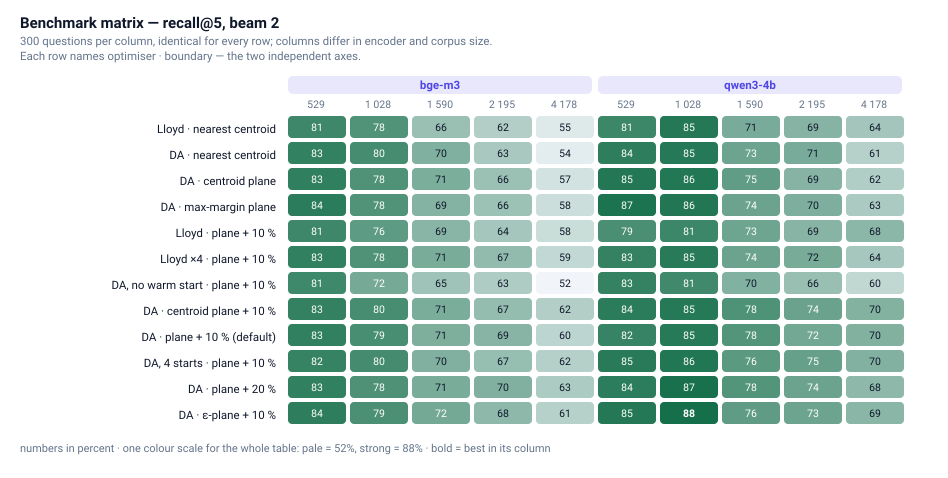
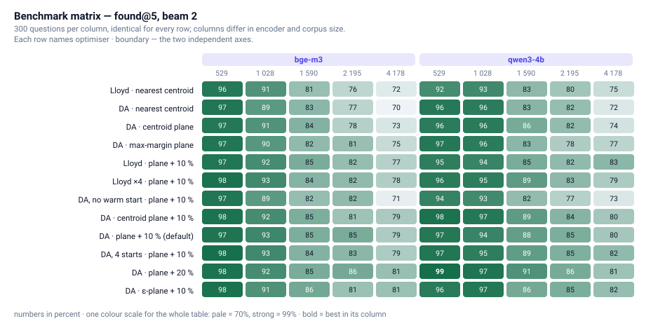
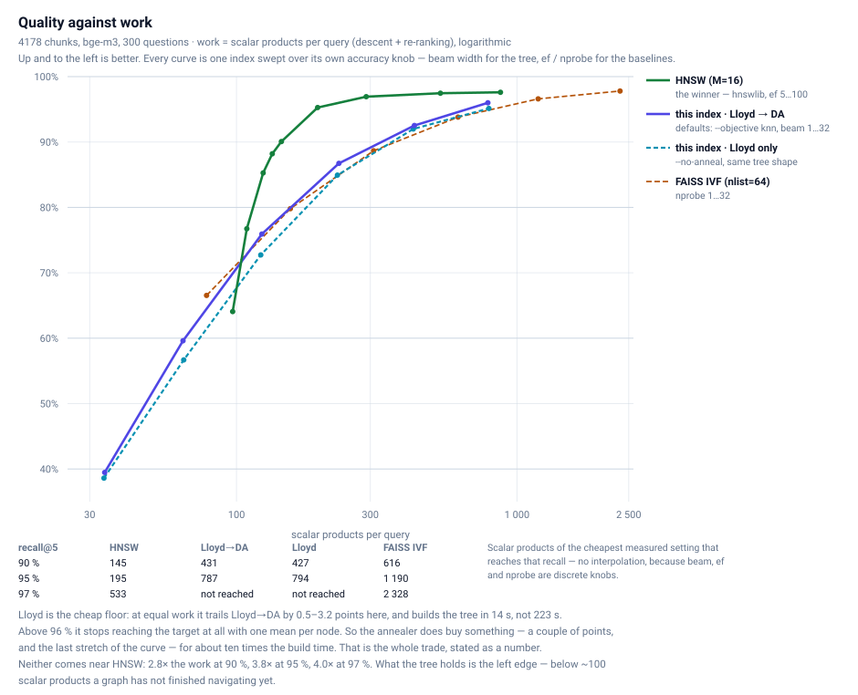
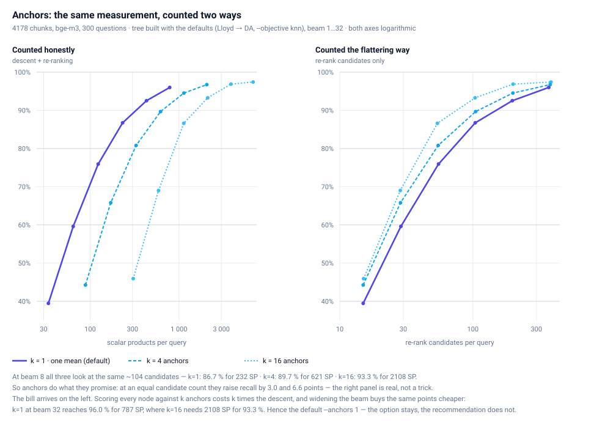

# Benchmarks

What this index achieves, what it costs, and where it loses — measured on
the reference knowledge bases against HNSW and FAISS IVF.

- [Two axes, not one](#two-axes-not-one)
- [What the objective can and cannot explain](#what-the-objective-can-and-cannot-explain)
- [The whole matrix](#the-whole-matrix)
- [The price of every variant](#the-price-of-every-variant)
- [How it scales](#how-it-scales)
- [Where this index stands against HNSW and FAISS](#where-this-index-stands-against-hnsw-and-faiss)
- [What anchors actually buy](#what-anchors-actually-buy)
- [The cheapest quality knob is the beam](#the-cheapest-quality-knob-is-the-beam)
- [What a query actually costs](#what-a-query-actually-costs)
- [Free quality: ask the model properly](#free-quality-ask-the-model-properly)

---

Two reference knowledge bases over **the same 4178 chunks with the same IDs**,
differing only in the encoder: `bge-m3` (1024d) and `qwen3-embedding:4b-fp16`
(2560d). The bge-m3 base was re-embedded from the qwen3 one, so chunk `k` is
the same text in both — same questions, same chunks, one variable.
**120 index builds × three beam widths = 360 measurements**, plus a
separate timing run:

```bash
# the corpus: subsets by whole documents, and 300 questions per base
python3 benchmarks/make_subsets.py reference-kb/RefKB_bge-m3 500 1000 1500 2000
python3 benchmarks/make_queries.py reference-kb/RefKB_bge-m3 …   # needs ollama

# build every variant, then measure
python3 benchmarks/run_matrix.py --kbs reference-kb/subsets/* reference-kb/RefKB_bge-m3
python3 benchmarks/evaluate.py --beam 1 2 4          # the variant matrix
python3 benchmarks/add_anchors.py <index> --k 4 16   # anchors, no rebuild
python3 benchmarks/evaluate_full.py                  # tree × anchors × search
python3 benchmarks/baselines.py                      # HNSW and FAISS IVF
python3 benchmarks/time_query.py                     # one BLAS thread, warm cache
python3 benchmarks/report.py                         # results.json → these tables

# the two diagnostics the framing rests on
python3 experiments/objective_vs_recall.py           # energy vs. severed neighbours
python3 experiments/annealer_gain.py                 # what the DA takes off Lloyd
```

**The corpus.** 149 German markdown and text files — city districts, dog
breeds, cars, AI models — chunked by `text-embedder` along markdown
structure: max 600 tokens, min 30, headings down to level 3 kept as context,
and **no overlap between chunks**. Non-overlapping chunks make the retrieval
task harder than it has to be: neighbouring chunks share no text, so a
question landing on a boundary has exactly one right answer rather than two
half-right ones. Everything below is measured against that.

**How a query is made.** Not self-retrieval — that only proves the tree can
find what it stored. A benchmark query is a random contiguous **60–80 % word
window of a chunk**, embedded with the same encoder. That is the RAG case: the
question covers an aspect of the chunk, so it lands a little beside it. 300
such queries per knowledge base, identical for every variant.

**What counts as right.** The truth is the *exact* search: cosine over all
chunk embeddings, top 5. Two numbers follow:

- **found** — the query's own source chunk is in the tree's top 5
- **recall@5** — overlap between the tree's top 5 and the exact top 5

Subsets are cut **by whole documents**, never by random sampling: a real
knowledge base is topically clustered, and sampling across all files would
destroy the very structure the partitioning exploits.

**What these numbers are not.** Single runs, one seed each — and tree builds
are not reproducible today, because parts of the recursion draw from
ungeseeded global RNGs. **Differences below roughly two points are inside the
noise** and no claim below rests on one.

## Two axes, not one

Every variant is a pair: **who bisects** (Lloyd's algorithm or the digital
annealer) and **how the boundary is drawn** afterwards (nearest centroid, a
plane, a plane plus overlap). Naming only the optimiser is what made earlier
drafts of this table misleading — `lloyd` below is *Lloyd with plane and
overlap*, and the bare baseline is `lloyd-raw`. Hold one axis fixed and the
other's contribution becomes readable:

**Which half of the pipeline does the work?** found@5 / recall@5, 4178 chunks, beam 2

*Same boundary, different optimiser — the annealer against Lloyd alone:*

| Boundary | Encoder | Lloyd | Digital Annealer | Δ recall |
|---|---|---|---|---|
| nearest centroid, no plane | bge-m3 | 72.0% / 54.8% | 70.0% / 53.9% | **-0.9** |
| nearest centroid, no plane | qwen3-4b | 75.0% / 64.5% | 72.3% / 61.4% | **-3.1** |
| max-margin plane + 10 % overlap | bge-m3 | 77.3% / 58.2% | 78.7% / 60.1% | **+1.9** |
| max-margin plane + 10 % overlap | qwen3-4b | 83.0% / 68.3% | 79.7% / 69.9% | **+1.6** |
| max-margin plane + 10 %, 4 restarts | bge-m3 | 78.0% / 59.3% | 78.7% / 61.6% | **+2.3** |
| max-margin plane + 10 %, 4 restarts | qwen3-4b | 78.7% / 63.9% | 82.3% / 69.9% | **+5.9** |

*Same optimiser, different boundary — the plane and the overlap against nearest-centroid assignment:*

| Optimiser | Encoder | nearest centroid | max-margin plane + 10 % | Δ recall |
|---|---|---|---|---|
| Lloyd | bge-m3 | 72.0% / 54.8% | 77.3% / 58.2% | **+3.4** |
| Lloyd | qwen3-4b | 75.0% / 64.5% | 83.0% / 68.3% | **+3.9** |
| DA | bge-m3 | 70.0% / 53.9% | 78.7% / 60.1% | **+6.2** |
| DA | qwen3-4b | 72.3% / 61.4% | 79.7% / 69.9% | **+8.5** |

Three things fall out, and they are the core result of this whole matrix:

**1. The boundary is the bigger lever.** Going from nearest-centroid
assignment to a max-margin plane with 10 % overlap is worth **+3.4 / +3.9
points under Lloyd and +6.2 / +8.5 under the annealer** — far more than
swapping the optimiser ever is.

**2. The annealer only pays off once a plane stores its work.** With no plane
it *loses* to Lloyd alone (−0.9 and −3.1). That is not a paradox: Lloyd
minimises within-cluster variance, which is exactly what nearest-centroid
lookup then re-evaluates at query time, so its partition survives the trip.
The annealer optimises a QUBO over the Gram matrix and finds a partition whose
centroids no longer describe it — the quality is real but unreachable until an
explicit separating plane is written into the tree. With that plane it turns
positive: **+1.9 / +1.6**, and +2.3 / +5.9 with four restarts.

Take that second point with the noise floor in hand, though. At +1.9 / +1.6
the annealer's edge is barely above it, and on qwen3 the two metrics disagree
outright — Lloyd scores the higher *found* (83.0 % against 79.7 %) while the
annealer scores the higher *recall*. The +5.9 in the restart row is inflated
by a weak `lloyd-mc4` build (63.9 %, below plain `lloyd` at 68.3 %, which four
restarts cannot legitimately be). The honest summary is: **with a plane the
annealer is somewhere between even and two points ahead, at ten times the
build time.** What is *not* ambiguous is the sign flip — without a plane it
loses on both encoders and both metrics.

**3. Both effects are small next to the encoder.** Lloyd with a plane on
qwen3 (68.3 % recall) beats the fully annealed default on bge-m3 (60.1 %). The
first euro goes into the embedding model, not into the index.

## What the objective can and cannot explain

This is the measurement the whole framing rests on, so it has its own script:
[`experiments/objective_vs_recall.py`](../experiments/objective_vs_recall.py).
It takes **every tree ever built on this knowledge base** — 22 of them, all on
the same 4178 points — and correlates two quantities against recall@5 at
beam 2:

- **E_root** — the QUBO energy of the root bisection, `pbf_energy_dense` on
  the very Gram matrix the annealer minimises. This *is* partition quality in
  the sense of the objective.
- **cut@10** — the share of the 28 890 symmetric 10-NN pairs that the tree
  separates, i.e. no leaf holds both. This is what actually ruins retrieval: a
  severed true neighbour is a candidate the descent never gets to see.

| Population | n | energy spread | corr(E_root, recall) | corr(cut@10, recall) |
|---|---|---|---|---|
| all trees | 22 | 79.3 % | **−0.78** | −0.77 |
| warm-started only | 19 | **0.52 %** | **+0.10** | **−0.91** |

Read the two rows together, because the difference between them *is* the
result. Taking all trees, the energy looks like a fine predictor — but the
only thing separating the groups is the three `*blind*` runs, the annealer
with no Lloyd warm start, where the objective is simply not solved (energy off
by a factor). Include them and you are measuring *solved against unsolved*.

Ask the question that comes after that one — among the trees that **do** solve
the objective, does the energy still explain anything? — and the answer is no.
Their energies sit within **0.52 %** of each other while recall spans
**53.9 % to 63.0 %**. The objective is saturated; the retrieval quality is
decided entirely elsewhere. What does explain it is cut@10, at **−0.91**.

**Hence `--objective knn`**: instead of the Gram objective, whose optimum is
already reached and no longer discriminating, bisect on the modularity of the
k-NN graph, which counts exactly the pairs that matter. Lloyd bisects in
coordinate space and never sees a graph matrix, so `--no-anneal --objective
knn` exits with an error rather than silently ignoring the flag.

And then the honest part: **end to end it is a wash.** The k-NN objective does
what it says — it cuts fewer true neighbour pairs than the Gram objective
(50.6 % against 51.8 % on the same tree shape) — but the effect is far too
small to move retrieval:

| Beam | bge-m3, Gram | bge-m3, k-NN | qwen3-4b, Gram | qwen3-4b, k-NN |
|---|---|---|---|---|
| 2 | 58.5 % | 59.6 % | 67.1 % | 67.2 % |
| 8 | 86.7 % | 86.7 % | 92.5 % | 92.3 % |
| 32 | 95.8 % | 96.0 % | 97.7 % | 96.7 % |

Averaged over both encoders the k-NN objective is worth about **+0.3 points**
— comfortably inside the noise of an unreproducible tree build. So the
mechanism is demonstrated and the diagnosis stands; the fix built on it does
not yet pay. That is the honest state of the idea, and the reason the next
step is a better objective rather than a better optimiser.

## The whole matrix

Every variant × every size × both encoders, on one colour scale so that a
column's colour means the same thing as the next column's — recall@5 first,
then found@5:





**All variants × both encoders — 4178 chunks, beam 2, 300 queries each**

| Optimiser | Boundary | Flags | bge-m3 found | recall@5 | leaf entries | build | qwen3-4b found | recall@5 | leaf entries | build |
|---|---|---|---|---|---|---|---|---|---|---|
| Lloyd | nearest centroid | `--no-anneal --split-mode none` | 72.0% | 54.8% | 4 178 | 14 s | 75.0% | 64.5% | 4 178 | 84 s |
| DA | nearest centroid | `--split-mode none` | 70.0% | 53.9% | 4 178 | 139 s | 72.3% | 61.4% | 4 178 | 165 s |
| DA | centroid plane | `centroid --spill 0` | 73.0% | 56.8% | 4 178 | 160 s | 73.7% | 62.1% | 4 178 | 175 s |
| DA | max-margin plane | `plane --spill 0` | 75.3% | 57.7% | 4 178 | 158 s | 76.7% | 63.1% | 4 178 | 178 s |
| Lloyd | max-margin plane + 10 % | `--no-anneal` | 77.3% | 58.2% | 10 514 | 28 s | 83.0% | 68.3% | 10 666 | 38 s |
| DA | centroid plane + 10 % | `centroid --spill 0.1` | 79.0% | 62.0% | 10 065 | 315 s | 79.7% | 69.7% | 10 152 | 403 s |
| **DA** | **max-margin plane + 10 %** | `plane --spill 0.1` | 78.7% | 60.1% | 10 331 | 323 s | 79.7% | 69.9% | 10 418 | 426 s |
| DA | max-margin plane + 20 % | `plane --spill 0.2` | 81.3% | 63.0% | 31 660 | 615 s | 80.7% | 68.0% | 32 015 | 743 s |
| DA | ε-aware plane + 10 % | `plane --spill 0.1 --eps 0.0745` | 81.0% | 61.3% | 9 164 | 228 s | 81.7% | 68.7% | 8 864 | 262 s |
| Lloyd ×4 | max-margin plane + 10 % | `--no-anneal --lloyd-mc 4` | 78.0% | 59.3% | 10 608 | 423 s | 78.7% | 63.9% | 10 648 | 1462 s |
| DA, 4 starts | max-margin plane + 10 % | `--lloyd-mc 4` | 78.7% | 61.6% | 10 164 | 2491 s | 82.3% | 69.9% | 10 246 | 2396 s |
| DA, no warm start | plane + 10 % | `--iterations-lloyd 0` | 71.0% | 51.7% | 11 651 | 372 s | 72.7% | 59.7% | 11 356 | 394 s |

Beyond the three points above:

**ε is the best deal in the table.** On both encoders it sits at or near the
top (81.0 % / 81.7 % found) while using the **fewest leaf entries of any
overlap variant** — 9 164 / 8 864 against 31 660 / 32 015 for double overlap —
and about a third of its build time. Spending overlap where the encoder is
actually unsure beats spending it everywhere.

**The warm start matters more than the annealer.** The DA started blind is the
worst variant on both encoders (51.7 % / 59.7 %) and among the most expensive.

**And it is not a step budget problem.** The obvious suspicion about the small
annealing gain is that the solver simply did not get to run long enough: the
schedule halves per level (`steps/2**depth`, floor 200) and AUTO puts level 0
at `n/3`, which for 4178 chunks is 1392 steps for 4178 variables — a third of
a step per variable. `benchmarks/convergence.py` tests exactly that on the
real root bisection: **1392 → 44 544 steps, 32× the budget, land on the same
energy to the tenth decimal** (−448388.6640981942 against −448388.6640981945).
The root is converged. What the per-depth statistics do show is that the
annealer's gain over its Lloyd start is tiny at the top (0.001 % at depth 0)
and large further down (30 % at depth 8) — the root basin is simply so
dominant that every start falls into it, which is the same landscape result
that makes multistarts useless here.

**Multistarts are not worth it.** Four Lloyd basins instead of one move recall
by +1.5 points on bge-m3 and −0.1 on qwen3 — inside the noise, and not even
the same sign — for **7.7× the build time** (2 491 s against 323 s). The
default of one basin stays.

## The price of every variant

**Build time, every variant × size × encoder**

| Optimiser | Boundary | Encoder | 529 | 1 028 | 1 590 | 2 195 | 4 178 | total |
|---|---|---|---|---|---|---|---|---|
| Lloyd | nearest centroid | bge-m3 | 1 s | 2 s | 5 s | 14 s | 14 s | **37 s** |
| Lloyd | nearest centroid | qwen3-4b | 2 s | 8 s | 6 s | 7 s | 84 s | **108 s** |
| DA | nearest centroid | bge-m3 | 13 s | 26 s | 42 s | 78 s | 139 s | **296 s** |
| DA | nearest centroid | qwen3-4b | 15 s | 49 s | 72 s | 75 s | 165 s | **376 s** |
| DA | centroid plane | bge-m3 | 13 s | 30 s | 47 s | 74 s | 160 s | **323 s** |
| DA | centroid plane | qwen3-4b | 18 s | 52 s | 94 s | 82 s | 175 s | **421 s** |
| DA | max-margin plane | bge-m3 | 13 s | 29 s | 48 s | 73 s | 158 s | **321 s** |
| DA | max-margin plane | qwen3-4b | 19 s | 55 s | 98 s | 79 s | 178 s | **429 s** |
| Lloyd | max-margin plane + 10 % | bge-m3 | 2 s | 4 s | 8 s | 11 s | 28 s | **53 s** |
| Lloyd | max-margin plane + 10 % | qwen3-4b | 2 s | 8 s | 17 s | 16 s | 38 s | **82 s** |
| DA | centroid plane + 10 % | bge-m3 | 23 s | 55 s | 94 s | 144 s | 315 s | **630 s** |
| DA | centroid plane + 10 % | qwen3-4b | 32 s | 81 s | 182 s | 155 s | 403 s | **853 s** |
| **DA** | **max-margin plane + 10 %** | bge-m3 | 22 s | 53 s | 92 s | 144 s | 323 s | **634 s** |
| **DA** | **max-margin plane + 10 %** | qwen3-4b | 31 s | 82 s | 179 s | 150 s | 426 s | **869 s** |
| DA | max-margin plane + 20 % | bge-m3 | 44 s | 118 s | 238 s | 353 s | 615 s | **1368 s** |
| DA | max-margin plane + 20 % | qwen3-4b | 58 s | 183 s | 345 s | 401 s | 743 s | **1730 s** |
| DA | ε-aware plane + 10 % | bge-m3 | 17 s | 39 s | 84 s | 126 s | 228 s | **494 s** |
| DA | ε-aware plane + 10 % | qwen3-4b | 22 s | 58 s | 95 s | 133 s | 262 s | **571 s** |
| Lloyd ×4 | max-margin plane + 10 % | bge-m3 | 28 s | 109 s | 146 s | 89 s | 423 s | **795 s** |
| Lloyd ×4 | max-margin plane + 10 % | qwen3-4b | 114 s | 79 s | 135 s | 341 s | 1462 s | **2131 s** |
| DA, 4 starts | max-margin plane + 10 % | bge-m3 | 68 s | 168 s | 302 s | 1485 s | 2491 s | **4514 s** |
| DA, 4 starts | max-margin plane + 10 % | qwen3-4b | 89 s | 210 s | 290 s | 675 s | 2396 s | **3660 s** |
| DA, no warm start | plane + 10 % | bge-m3 | 23 s | 55 s | 103 s | 179 s | 372 s | **733 s** |
| DA, no warm start | plane + 10 % | qwen3-4b | 28 s | 101 s | 165 s | 174 s | 394 s | **862 s** |

**Read these as orders of magnitude, not stopwatch readings.** `run_matrix.py`
builds up to three indexes at once, so a single cell carries whatever else the
machine was doing (which is why a few rows are not monotone in size — qwen3
`Lloyd ×4` at 529 chunks is not really slower than at 1 028). The ratios
between rows survive that; the individual seconds do not. Query times are
measured separately for exactly this reason — see
[What a query actually costs](#what-a-query-actually-costs).

With that caveat, two things stand out. Among the annealing variants the qwen3
column costs only **1.2–1.4× more** despite 2.5× the dimension — the annealing
itself does not care how long the vectors are, only the Gram matrix does. And
`--no-anneal` is in a different league throughout: **53 s against 634 s** for
the same tree shape, across all five sizes, at a cost of 1.9 points of recall.
That ratio, not the annealer's small edge, is the real finding of this table.

## How it scales

**Scaling — `default`, beam 2.**  Δ recall is the gain from the stronger encoder; it grows with the corpus.

| Chunks | bge-m3 found | recall@5 | qwen3-4b found | recall@5 | Δ recall | leaf entries | overhang |
|---|---|---|---|---|---|---|---|
| 529 | 97.3% | 83.2% | 96.7% | 82.3% | -0.9 | 922 | 1.74× |
| 1 028 | 93.3% | 79.3% | 94.0% | 84.8% | +5.5 | 2 032 | 1.98× |
| 1 590 | 85.0% | 70.6% | 88.3% | 77.6% | +7.0 | 3 395 | 2.14× |
| 2 195 | 85.3% | 69.0% | 85.0% | 72.5% | +3.5 | 4 830 | 2.20× |
| 4 178 | 78.7% | 60.1% | 79.7% | 69.9% | +9.8 | 10 418 | 2.49× |

Recall drops with size, which is what an approximate index does — more chunks
compete for the same five slots. The drop is **much gentler on the stronger
encoder**, so its advantage grows with the knowledge base: −0.9 points at 529
chunks, +9.8 at 4178. That is the practical argument for spending on the
encoder precisely when the corpus is large. The overlap factor rises from
1.74× to 2.49×, close to the predicted `(N/g)^log₂(1+f)` (see
[What spill costs](pipeline.md#what-spill-costs)).

## Where this index stands against HNSW and FAISS



The only honest axis for comparing indexes is **work per query**: scalar
products for the descent *plus* the exact re-ranking of candidates. Counting
only candidates flatters whatever moves its effort into navigation.

Every number below is the **cheapest measured setting that reaches the
target** — no interpolation, because beam, `ef` and `nprobe` are discrete
knobs and an interpolated point is a configuration nobody can set.

| Target | HNSW (M=16) | this index, defaults | this index, best in the matrix | Lloyd only | FAISS IVF |
|---|---|---|---|---|---|
| 90 % recall@5 | **145** (ef=5) | 431 (beam 16) | 409 (beam 16) | 427 (beam 16) | 616 (nprobe=8) |
| 95 % | **195** (ef=10) | 787 (beam 32) | 744 (beam 32) | 794 (beam 32) | 1190 (nprobe=16) |
| 97 % | **533** (ef=50) | — | 2138 (beam 32, 4 anchors) | — | 2328 (nprobe=32) |

*defaults* = `--objective knn`, Lloyd → DA, one mean per node, `--spill 0.05`.
*best in the matrix* = the cheapest of all 60 measured tree configurations:
the Gram objective at 90 and 95 %, and — worth saying out loud — a **Lloyd**
tree with 4 anchors at 97 %. *Lloyd only* = `--no-anneal`, same boundary, same
beam sweep. A dash means the target is out of reach with one mean per node and
beam ≤ 32; anchors are the way up from there, at the price the next section
measures.

**HNSW needs 2.8–4.0× less work for the same recall** (3.0–4.0× against the
shipped defaults). That is the plain result, and it has a structural reason: a
tree makes one hard, irreversible decision at the root — measured, **21 % of
queries take the wrong branch there** — while a navigable graph has no root to
get wrong. Beam width, spill and anchors all buy that irreversibility back,
which is why they help; none of them removes the cause.

**Lloyd alone is a real option.** At equal work it trails the annealer by
+0.5 to +3.2 points on bge-m3 (−0.3 to +6.1 on qwen3-4b), and the gap closes
as the beam widens — at beam 32 the two are level. In the table above, the 90
and 95 % columns are within 1 % of each other, which is well inside the noise
of a tree build that is not reproducible. And Lloyd gets there in **14 s
instead of 223 s**.

What the annealer holds onto is the top of the curve: past 96 % the Lloyd tree
stops reaching the target at all with one mean per node, where `knn-da` still
gets to 96.0 %. So if you want a cheap tree index and can live at 90–95 %,
`--no-anneal` is the honest recommendation — and that is worth saying plainly
in a repository named after the annealer.

What does hold up against the field: **this index beats FAISS IVF throughout**,
a standard production index, at 90 % with 409 against 616 and at 95 % with 744
against 1190. And below ~100 scalar products it is the only option at all —
HNSW cannot go under ~97, because the graph has to be traversed before it can
answer anything.

The design point is therefore not speed. It is a folder with readable split
planes and a self-contained `query.py`: no graph in memory, no server, nothing
to keep warm — and every decision inspectable.

## What anchors actually buy



A node is normally represented by **one mean**, and the beam scores it
`cos(q, mean)`. With `--anchors K` it carries **K k-means centres of its own
points** instead, and the score becomes `max_j cos(q, aⱼ)` — a much better
stand-in for "how close does this subtree get to the query" (the reasoning is
in [Why one mean is not enough](pipeline.md#why-one-mean-is-not-enough)). The split planes
do not change, so anchors can be **attached to a finished index** without
rebuilding it: `benchmarks/add_anchors.py` writes `anchors_k<K>.npz` next to
the tree and leaves `ann_tree.json` untouched.

Measured on the default tree (`knn-da`, bge-m3, 4178 chunks, 300 questions):

| Beam | candidates | k = 1 | k = 4 | k = 16 |
|---|---|---|---|---|
| 4 | ~55 | 75.9 % · 123 SP | 80.8 % · 329 SP | 86.6 % · 1133 SP |
| 8 | ~104 | 86.7 % · 232 SP | 89.7 % · 621 SP | 93.3 % · 2108 SP |
| 16 | ~200 | 92.5 % · 431 SP | 94.5 % · 1137 SP | 96.9 % · 3851 SP |
| 32 | ~380 | 96.0 % · 787 SP | 96.7 % · 2059 SP | 97.4 % · 6841 SP |

Read it twice, which is what the figure does.

**Counting candidates only, anchors win and it is not a trick.** At the same
~104 candidates the recall goes 86.7 → 89.7 → 93.3 %, so +3.0 and +6.6 points
for a strictly better node score. The descent really does land in better
leaves.

**Counting all the work, anchors lose.** Scoring every node on the way down
against K anchors costs K times the descent, and the descent is the larger half
of the bill. Widening the beam buys the same points far cheaper: k=1 at beam 32
reaches **96.0 % for 787 scalar products**, where k=16 at beam 8 gets **93.3 %
for 2108**. Only at the very top does the order flip — 97 % is out of reach
with one mean per node, and the cheapest configuration that gets there anywhere
in the matrix is a Lloyd tree with 4 anchors at 2138 SP.

Storage is the second bill: on this 4178-chunk base `anchors_k4.npz` is 13.3 MB
and `anchors_k16.npz` is 46.3 MB against 17.1 MB for the embeddings themselves.
Computing them takes 4.9 s and 10.6 s — next to nothing beside the 223 s tree
build, which is exactly why they are worth having as an option.

So: **`--anchors 1` is the default and stays the recommendation.** The
mechanism is sound and the option is kept, because it is the representation a
best-first search would need — and that is the other half of the story:
best-first over anchors was measured too, gained about one point, and is
therefore *not* built in. The script is in
[`experiments/best_first.py`](../experiments/best_first.py).

## The cheapest quality knob is the beam

**Beam width — `default` on 4178 chunks.**  Costs nothing at build time and beats every indexing option above.  Times from `time_query.py`: one BLAS thread, median of five rounds.

| Beam | Encoder | found | recall@5 | chunks visited | ms/query |
|---|---|---|---|---|---|
| 1 | bge-m3 | 63.3% | 41.5% | 16 | 0.056 |
| 1 | qwen3-4b | 66.3% | 50.3% | 15 | 0.091 |
| 2 | bge-m3 | 78.7% | 60.1% | 28 | 0.083 |
| 2 | qwen3-4b | 79.7% | 69.9% | 28 | 0.126 |
| 4 | bge-m3 | 88.7% | 75.1% | 51 | 0.126 |
| 4 | qwen3-4b | 88.7% | 83.2% | 50 | 0.207 |

Widening the beam from 2 to 4 buys **10 points of found and 13–15 points of
recall**, more than any indexing option in the matrix — and it needs no
rebuild, because the beam is chosen per query. Spend here first.

## What a query actually costs

**Query time — 4178 chunks, beam 2, one BLAS thread, median of five rounds.**  Leaf entries, tree depth and visited chunks are from the bge-m3 index.

| Optimiser | Boundary | leaf entries | depth | chunks visited | bge-m3 ms/query | qwen3-4b ms/query |
|---|---|---|---|---|---|---|
| Lloyd | nearest centroid | 4 178 | 12 | 29 | 0.093 | 0.138 |
| DA | nearest centroid | 4 178 | 10 | 30 | 0.089 | 0.128 |
| DA | centroid plane | 4 178 | 10 | 29 | 0.070 | 0.111 |
| DA | max-margin plane | 4 178 | 10 | 30 | 0.071 | 0.116 |
| Lloyd | max-margin plane + 10 % | 10 514 | 15 | 28 | 0.086 | 0.127 |
| DA | centroid plane + 10 % | 10 065 | 12 | 29 | 0.082 | 0.128 |
| **DA** | **max-margin plane + 10 %** | 10 331 | 13 | 28 | 0.083 | 0.126 |
| DA | max-margin plane + 20 % | 31 660 | 14 | 28 | 0.092 | 0.144 |
| DA | ε-aware plane + 10 % | 9 164 | 13 | 27 | 0.091 | 0.134 |
| DA, 4 starts | max-margin plane + 10 % | 10 164 | 12 | 28 | 0.078 | 0.130 |

**Overlap is paid at build time and in storage, never per query** — which is
the point of the whole design. The `chunks visited` column barely moves: 27 to
30 across every variant, from the index holding 4 178 leaf entries to the one
holding 31 660. A query at beam 2 lands in two leaves and re-ranks what is in
them; how many *other* leaves also keep a copy of some chunk is nothing to it.
The 11 % that double overlap does cost tracks the one extra level of depth
(14 against 13) — one more dot product on the way down.

So across all variants, encoders and beam widths the spread is 0.07–0.21 ms,
and the only factor with a clear signature is the embedding dimension: qwen3
costs about 50 % more than bge-m3 throughout. Whatever you pick for quality,
the query stays far below the time it takes to embed the question.

Three warnings, because these numbers are easy to get wrong. They are
measured by `time_query.py`, not taken from the evaluation run:

1. **One BLAS thread** — otherwise the figure says what eight cores do to one
   query instead of what one query costs.
2. **A warm node cache** — `rag_query` stores child vectors on the node at
   first descent; measured cold, beam 1 comes out *slower* than beam 2, which
   is an artefact, not a result.
3. **An idle machine.** One BLAS thread only stops *us* from flooding the
   box, not everybody else. Measured against a load average of 10.8 the same
   query came out at 0.19 ms instead of 0.06 — a factor of three, in numbers
   that look perfectly plausible on the page. `time_query.py` therefore
   refuses to measure above a load average of 2.0 unless `--max-load` says
   otherwise, and the run above was made below it.

**Not measured: the default.** The table is beam 2; the shipped default is
beam 8, and its time has not yet been taken on an idle machine. Candidates
roughly double with every beam step (28 → 51 → 104 → 198), so expect the cost
to scale with them — but that is an expectation, not a measurement, and it is
listed as open work rather than quoted as a number.

## Free quality: ask the model properly

Qwen3-Embedding is an instruct model — the query side improves when the task
is stated, while documents stay raw. Same index, same 300 questions, only the
query text prefixed with `Instruct: Given a search query, retrieve relevant
passages that answer the query\nQuery: `:

| Query form | found | recall@5 |
|---|---|---|
| plain window | 79.7 % | 69.9 % |
| **with instruct prefix** | **84.7 %** | **72.1 %** |

**+5.0 points of chunk retrieval for a string concatenation** — more than the
digital annealing contributes over Lloyd alone, and it costs nothing at
either index or query time. Worth checking whatever encoder you use.
