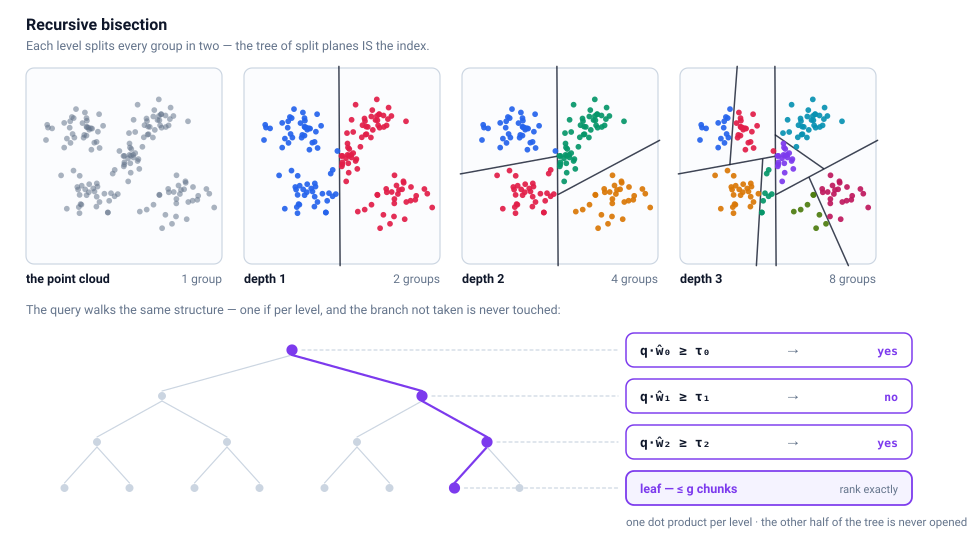

# The core idea

Why this index is a tree, how the recursion builds it, and what the two
bisectors do. Start here if you want to understand the design before the
parameters.

- [Related projects](#related-projects)
- [References](#references)

---

We build the approximate nearest neighbour index by **divide and conquer**.
The chunk embeddings are treated as a similarity graph, and that graph is
**partitioned by recursive bisection**: cut the whole set in two, cut each
half in two again, and keep going until a group is small enough to read
exhaustively. Nothing is searched a second time — the space is carved up
once, and a query afterwards only has to find its corner. The same multilevel
divide-and-conquer framing is used in graph partitioning for other
combinatorial problems, e.g. Khan et al. on the travelling salesman
[[2]](#references).

What the recursion leaves behind is the index: a binary tree whose inner nodes
hold no data at all, only a **decision** — one plane, stored as a normal
vector. Nothing about a chunk is written into the tree except which side of
each plane it came down on.

That makes the query almost free. It walks root to leaf answering one question
per level, *which side of this plane am I on*, and each question is a single
dot product. The walk is sequential, but it is only `log₂(N/g)` steps: 8
levels for 4 000 chunks, 16 for a million. Measured on the 4178-chunk
reference base, a query takes **0.08 ms at beam 2 and 0.13 ms at beam 4**
(1024d, one core — see [What a query actually costs](benchmarks.md#what-a-query-actually-costs)),
and most of that is re-ranking the candidate chunks at the bottom rather than
descending. The shipped default is beam 8, whose time is not yet measured on
an idle machine. A million chunks doubles the number of levels; that case is
extrapolated from the depth, not measured. The whole index is a
folder with a self-contained `query.py` in it — no server, no daemon, nothing
to keep warm, which is also what makes it easy to hand to an agent.

So the construction is simple. The quality is entirely in **where the cuts
go**: slice through a dense region and every query landing there goes down the
wrong branch, with no way back. That is the one question this library is
about, and it answers it at three increasing levels of effort, each of which
can be switched on and off on its own:

- **Lloyd (k=2)** — the naive cut, and a decent one. Lloyd's algorithm is
  *the* k-means algorithm; this document calls it Lloyd throughout, including
  in the benchmark tables. A handful of iterations on the group and most
  splits are already sensible. Fast enough to build a whole tree in seconds,
  and it is the baseline everything else has to beat.
- **A QUBO solved by digital annealing** — one binary variable per chunk
  saying which half it belongs to, minimising an energy over *all pairwise*
  similarities at once instead of iterating centroids. This is the binary
  clustering formulation of Bauckhage et al. [[1]](#references), solved
  heuristically by a batched digital annealer that is warm-started from the
  Lloyd solution.
- **Post-processing on the finished split** — because the partition an
  optimiser likes is not automatically one a greedy descent can follow. The
  boundary gets re-derived as a plane, shifted into the emptiest gap it can
  find, and given safety margins: an overlap zone, and a tolerance ε measured
  from the encoder's own noise.

Each of the three is taken apart in its own document:
[pipeline.md](pipeline.md) walks one bisection step by step,
[configuration.md](configuration.md) lists every parameter with the
measurement behind its default, and [benchmarks.md](benchmarks.md) says what
each level is actually worth.

## Related projects

- **[text-embedder](../../text-embedder/)** — produces the input run folders
  (chunking + embeddings via Ollama or Gemini API). Its output format
  (`specs.json` + `chunks.jsonl` + `embeddings.jsonl`) is the contract
  between the two projects.
- **[annealing-qubo-optimizer](../../annealing-qubo-optimizer/)** — the DA
  backend used by default (`--solver fast`), expected at
  `../annealing-qubo-optimizer/Code`. A heuristic batched NumPy annealer
  with no optimality guarantee: the QUBO goes in as a matrix `(A, b, c)`,
  all Monte-Carlo trials of a start group run as one `(mc, n)` batch.
  Its README carries the cooling contract (`da_gp` slots, calibration,
  the three exploration controls) and the performance numbers this
  project's `MC_TARGET_MCN` cap is derived from.
- **[annealing-cop-approximator](../../annealing-cop-approximator)** — the original dict-based reference
  implementation (`pbf_min_solver`), expected at
  `../annealing-cop-approximator/Code`. Only used with `--solver reference`,
  and only to cross-check: both paths encode the same energy and agree to
  ~1e-14. The import is allowed to fail — without it, only the fast
  backend is available.

## References

1. C. Bauckhage, E. Brito, K. Cvejoski, C. Ojeda, R. Sifa, S. Wrobel,
   *Adiabatic Quantum Computing for Binary Clustering*, arXiv:1706.05528
   (2017) — the QUBO/Ising formulation of binary clustering this project's
   bisection objective is taken from.
2. A. A. Khan, M. U. Khan, M. Iqbal, *Multilevel Graph Partitioning Scheme to
   Solve Traveling Salesman Problem*, 2012 Ninth International Conference on
   Information Technology — New Generations (ITNG), 2012.
   [DOI 10.1109/ITNG.2012.106](https://doi.org/10.1109/ITNG.2012.106) — the
   recursive divide-and-conquer framing of graph partitioning.

Every figure in this documentation is generated from real splits by
[`docs/img/make_figures.py`](img/make_figures.py) — one run rewrites all nine.

---
