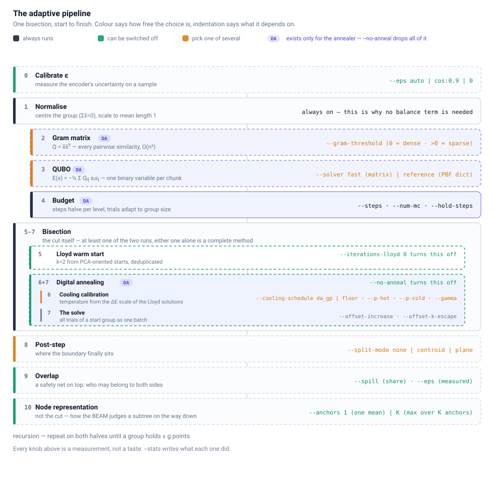
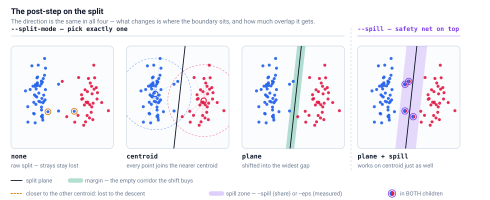
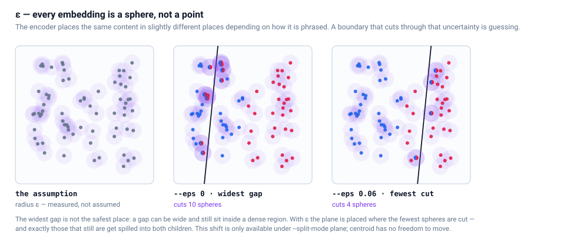
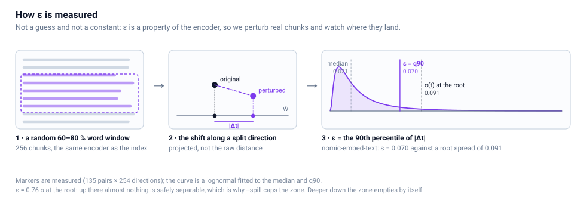

# The indexing pipeline

One bisection, step by step: what runs always, what can be switched off,
and what each step is there to fix.

- [The adaptive pipeline](#the-adaptive-pipeline)
- [Planning for the encoder's own error](#planning-for-the-encoders-own-error)
- [Measuring ε](#measuring-ε)
- [What the post-step guarantees](#what-the-post-step-guarantees)
- [What spill costs](#what-spill-costs)
- [Why one mean is not enough](#why-one-mean-is-not-enough)

---

## The adaptive pipeline

Indexing is one loop: bisect a group, recurse into both halves, stop at `g`
points. What happens *inside* one bisection is a chain of steps, and most of
them can be switched off, swapped, or dialled — that is the adaptive part.



Two things are encoded in that picture. **Colour** says how free the choice
is: grey always runs, green can be turned off entirely, amber means you pick
one of several. **Indentation** says what a step depends on — steps 2, 3 and 4
are indented because they exist only to feed the annealer. `--no-anneal` does
not just skip step 7, it skips the Gram matrix, the QUBO and the budget with
it, which is where the O(n²) goes.

Steps 5–7 are the bisection itself, and that box is **not optional** — the cut
has to come from somewhere. What is optional is who makes it: **Lloyd** (5) and
**digital annealing** (6+7) each work alone, they work together (the default,
Lloyd warm-starting the DA), and turning both off is the one combination that
raises an error.

**Input.** `rag_indexer.py` reads a text-embedder run folder and stacks all
chunk embeddings into one `(n, d)` array `X`. Row `i` belongs to
`chunk_ids[i]`. Nothing is normalised at this stage — `X` is stored as-is in
`embeddings.npy`, and the query descent later works on these raw vectors.

**0. Calibrate ε** (`--eps`, off by default) — once per run, before the tree.
An embedding is not an exact coordinate: the same content, phrased differently
or cut differently, lands somewhere nearby. `--eps auto` measures how far:
sample 256 chunks, take a random 60–80 % word window of each, embed those with
the *same* encoder, and look at how much the projection onto a split direction
moves. The 90th percentile of that shift is ε. Step 9 uses it. See [planning for the encoder's own error](#planning-for-the-encoders-own-error).

**Recursion.** `partition_tree` bisects the full index set, then each half,
until a group holds `≤ g` points. Everything below happens **once per
bisection**, on that group's own points (global indices into `X`).

**1. Normalisation** (`normalize_coords`, always on) — subtract the group's
centroid so `Σ x̃ᵢ = 0`, then scale so the mean vector length is 1. Both are
local: every bisection re-centres on its own points. The centring is not
cosmetic — it is the reason no balance term is needed anywhere (see step 3).

**2. Gram matrix** (`--gram-threshold`; DA only) — `Q = x̃ x̃ᵀ`, every pairwise
similarity in the group. Dense by default; with a threshold `> 0` entries with
`|Q[i,j]| < thr` are dropped **during** the blockwise computation, so they
exist nowhere — neither as quadratic terms nor inside the row/column sums, and
the dense n×n matrix never materialises. This is the O(n²) step, and the only
one that `--no-anneal` skips entirely.

**3. QUBO** (`--solver`; DA only) — `A = −(Q + Qᵀ)` with zero diagonal,
`b = Q_row + Q_col − 2·diag(Q)`, `c = 0`. This is exactly the spin formulation
`E(x) = −½ · Σ Q_ij s_i s_j` with `s = 2x − 1`. Because step 1 centred the
group, `d_i = Σ_j Q_ij = 0` and the linear term vanishes; the objective is
effectively **`E(x) = −2‖S_A‖²`** with `S_A = Σ_{i∈A} x̃_i`. It maximises the
norm of the group centroid — which is exactly what the query descent asks
about later. For equally sized groups this is the 2-means objective
`2·n₁n₂‖μ₁−μ₂‖²` (measured correlation −1.0000000000), which is why no
Lagrange balance term is needed: centring already does that work. `--solver
reference` builds the same energy as a PBF dict instead of a matrix.

**4. Budget per level** (`--steps`, `--num-mc`, `--hold-steps`; DA only) —
`steps`
halve with depth, `max(STEPS_FLOOR, steps / 2**depth)` with
`STEPS_FLOOR = 200`. Groups below `MC_SMALL_N = 100` points get at least
`MC_SMALL_TRIALS = 100` Monte-Carlo trials — the batched optimizer runs them
in one pass, so the steps saved on small groups are spent on trials instead.
From above, `MC_TARGET_MCN = 2e5` caps `num_mc` so that `mc·n` stays out of
the DRAM-bandwidth regime. A plateau (`--hold-steps`) halves the same way,
capped at `HOLD_MAX_FRAC` of the steps used.

**5. Lloyd warm start** (`--iterations-lloyd`, `--lloyd-mc`; `0` = off) —
k=2 Lloyd from PCA-oriented starts. Trials 1..4 start from the sign splits of
the leading principal components, further trials from a random direction with
its top-PC projection removed — scattering *against* the components, because
along them Lloyd always converges into the same basin. Each start is refined,
duplicates are removed by canonical form, and the solutions are **never
rebalanced**: repairing them would destroy the very start values the cooling
calibration reads. With `--no-anneal` this step *is* the bisection.

**6. Cooling calibration** (`--cooling-schedule`, `--p-hot`, `--p-cold`,
`--gamma`) — the best Lloyd solution's energy `E_lloyd` and a random state's
`E_start` measure how deep the landscape is. With `--cooling-per-group`
(default) **every** start group gets its own schedule from its own ΔE vector:
the deepest solution has the largest ΔE scale, and its `c` would be 1.6–2.6×
too hot for the flatter starts. `da_gp` ends below the freezing limit,
`da_gp_floor` approaches it. Without a warm start the schedule falls back to
`["logarithmic", a, b]`.

**7. Digital annealing** (`--anneal` / `--no-anneal`) — every unique Lloyd
solution becomes a start group with `--num-mc` trials, all trials of a group
running as one `(mc, n)` batch. One accepted flip per step (DA semantics); the
E_Offset lifts a stuck trial out of a local minimum, scaled by
`--offset-k-escape`. If no trial beats the Lloyd start, the Lloyd solution is
used directly. `--no-anneal` removes this step *and* steps 2, 3, 4 and 6 with
it — the bisection is then pure Lloyd, O(n·d) instead of O(n²), and the
multi-starts are ranked by their own 2-means objective. On a 600-point group
that is 0.03 s instead of 3.6 s. It is the honest baseline: whatever the DA is
worth, it has to be worth it against this.

**8. The post-step** (`--split-mode`, default `plane`) — the DA answers *which
points belong together*; the descent asks *which side of a boundary a query is
on*. Those are not the same question, and the post-step is what reconciles
them.



- `none` keeps the raw split. A point can sit in the QUBO-correct group while
  being closer to the sibling centroid, and the descent will never find it
  again — measured 3.6 % of all assignments, with peaks at depth 2/4/5.
- `centroid` computes the two group centroids, **freezes** them, and
  re-assigns every point to whichever is closer. Geometrically that is a
  hyperplane through the origin with normal `ŵ = m̂_A − m̂_B`. Now every point
  lies in the child whose centroid is nearer, on every level, so a greedy
  descent cannot take a wrong turn: self-retrieval 93.2 % → **100 %**.
  (Self-retrieval feeds a chunk's own vector back in and is the easy test —
  the [benchmarks](benchmarks.md#benchmarks) below use perturbed queries instead, which is
  why the numbers there are lower and more interesting.)
- `plane` keeps that direction but **shifts the plane along it** into a gap:
  project `tᵢ = pᵢ·ŵ`, sort, and put `τ` in the middle of the widest gap
  inside the middle corridor (`MARGIN_QUANTILE = 0.2`, so a single outlier
  cannot be split off). One dimension, one sort. The node then stores
  `(ŵ, τ, σ)` and the descent decides on `q·ŵ − τ`.

`plane` is the shifted version of `centroid`, not an addition to it — you pick
one. What `plane` buys is a **margin**: if the nearest point sits δ away from
the boundary, then every query `q` with `‖q − p‖ < δ` takes the same turn as
its chunk `p`, because `|q·ŵ − p·ŵ| ≤ ‖q − p‖ < δ`.

**9. Overlap** (`--spill`, `--eps`) — a safety net bolted on top of step 8,
not part of choosing the boundary. The points closest to the boundary are put
into **both** children. That needs no gap in the data, which is exactly why it
covers the upper levels where shifting cannot help: at the root the best
achievable margin is 0.001 against a spread of 0.18 — the space is a continuum
at that scale. Two ways to decide who overlaps:

- `--spill f` — a **fixed share**: the `f·n` points nearest the boundary.
  Predictable, and the cost is bounded by construction: `(1+f)` more points
  per level, `(N/g)^log₂(1+f)` leaf entries in total.
- `--eps e` — **measured**: every point whose uncertainty interval
  `[t−ε, t+ε]` crosses the boundary, and only those. Where the plane already
  runs through a clean gap, nothing spills at all. `--spill` then acts as the
  ceiling, so the cost bound still holds.

ε also changes step 8 itself — it moves the plane, not just the overlap. That
is a method of its own and gets its
[own section](#planning-for-the-encoders-own-error) below.

Overlap works with `centroid` and with `plane`: it only needs *a* boundary to
measure distance to, which is why it is unavailable under `none`. What it
costs is in [What spill costs](#what-spill-costs).

There is **no rebalancing step**. Forcing the two sides to equal size would
push the split against the very objective the DA just minimised, and since the
post-step decides group membership anyway, the sizes settle on their own.

**10. Node representation** (`--anchors`, `1` = off) — the only step that
changes nothing about the partition. It decides how the beam *judges* a
subtree on the way down: one mean (`cos(q, mean)`) or K anchors
(`max_j cos(q, aⱼ)`). Pure query-side, applied after the recursion has
finished — see [Why one mean is not enough](#why-one-mean-is-not-enough).

**Tree export.** Every node carries its `mean` (the frozen split centroid
where a post-step applied, otherwise the group average) plus `(w, τ, σ)` where
a plane was fitted, and `[offset, count]` into `anchors.npy` if step 10 ran;
leaves additionally carry their embedding rows. That is `ann_tree.json`.

**Query.** The embedding comes from outside. `query.py` descends the tree,
keeping the best `--beam` branches per level, and widens the beam until at
least `--min-candidates` (default 3·k) chunks are collected. Those candidates
are then ranked exactly by cosine against the query, and the top k chunk paths
are returned. One beam slot is always pinned to the greedy path — the plane
score is a signed distance to *that node's* boundary and is not comparable
across different parents, so scoring the frontier purely by it costs recall
(measured 79 % → 72 % when we tried).

## Planning for the encoder's own error

Everything above treats an embedding as a coordinate. It isn't. Feed the same
content to the encoder twice, phrased differently or cut differently, and it
lands somewhere nearby but not in the same place. A query is that same content
again, phrased a third way. So the honest model is not a point but a **sphere
of radius ε** — and a boundary that slices through a sphere has decided
something the embedding never actually said.



That changes the question the plane is answering. Without ε it looks for the
**widest gap**, which sounds right and often is — but a gap can be wide and
still sit inside a dense region, with points crowding it from both sides. With
`--eps e` the plane looks for the gap where the **fewest spheres get cut**,
i.e. the fewest points inside `|t − τ| ≤ ε`, and falls back to the widest gap
only to break ties. In the figure above that is the difference between cutting
10 spheres and cutting 4 — same direction, same data, one parameter.

Two consequences worth stating plainly:

- This shift is **only available under `--split-mode plane`**. `centroid`
  nails the boundary to `τ = 0`; there is no freedom left to use.
- `--eps 0` makes every zone empty, the tie-break becomes the only criterion,
  and the rule collapses to the original widest-gap choice **bit for bit**.
  Turning ε on cannot silently change an existing configuration.

Whatever spheres remain cut are exactly the points that then **spill** into
both children (step 9) — which is the second, separate use of the same number.

## Measuring ε

ε is a property of the encoder, not of the corpus, so it gets measured on the
encoder. `--eps auto` does that once per run, before the tree is built.



Sample 256 chunks, cut a random contiguous 60–80 % word window out of each —
that is the RAG case, a query rarely covers a whole chunk — and embed those
windows with the *same* encoder the index uses. Then project the difference
vectors onto 256 directions drawn the way real split directions arise
(differences of random point pairs), and take the **90th percentile of |Δt|**.

The unit matters more than anything else here. The boundary compares
`t = p̂·ŵ`, the projection of a *normalised* point onto a unit direction, so ε
must be in that unit — not a distance in embedding space. A perturbation of
length `‖Δp̂‖` can move `t` by at most `‖Δp̂‖` (Cauchy-Schwarz) but typically
moves it by far less. Put the raw distance in and you spill half the tree.

Measured on nomic-embed-text, 135 chunks:

| | value |
|---|---|
| median \|Δt\| | 0.021 |
| **ε = q90** | **0.070** |
| q99 | 0.159 |
| σ(t) at the root | 0.091 |

So **ε = 0.76 σ**. At the root essentially nothing is safely separable — the
space is a continuum at that scale — and `--spill` is the binding constraint.
Further down, where real gaps exist, the ε-zone empties out on its own and the
overlap stops costing anything. Blunt where it has to be, surgical where it
can be.

For comparison, deriving ε from a known paraphrase cosine
(`--eps cos:0.9`, which assumes the shift spreads isotropically over all `d`
dimensions) gives 0.016 — **4× smaller than the measured value**. Encoder
noise is not isotropic; it lives in the same directions the data varies in.
Which is the whole argument for measuring it rather than assuming it.

`auto` needs the `ollama` provider, because it has to call the very encoder
the index was built with; for anything else, pass `cos:` or a number.

## What the post-step guarantees

With `centroid` every point lies in the child whose centroid is closer to it,
on every level — a **greedy descent cannot take a wrong turn** for a point
that is in the tree. With `plane` that extends to a neighbourhood: given
margin δ, every query within δ of a chunk takes the same turns as the chunk.
`--spill` covers what shifting cannot, by putting the points nearest the
boundary into both children.

How much each of these is worth is measured in [Benchmarks](benchmarks.md#benchmarks), on
two encoders and five knowledge-base sizes, with perturbed queries rather than
self-retrieval. Short version: re-deriving the boundary as a plane is worth
5.3 points of chunk retrieval over the raw split, the overlap another 3.4 on
top, and ε gets the same result as double overlap on a third of the memory.

One caveat that applies to every number in these docs: tree builds are
**not reproducible**. Parts of the recursion draw from ungeseeded global
RNGs, so `--seed` does not pin the result and the spread behind a single
measurement is unknown. Treat differences below ~2 points as noise.

## What spill costs

A spilled point sits in both children, so it is split again on the next level
— in both subtrees. Each level therefore carries `(1+s)` times the points of
the level above, and after `d` levels the tree holds `(1+s)^d` times the
original point count. Since the recursion runs until a group fits in `g`
points, `d ≈ log₂(N/g)`, and the overhang is a **power law in the knowledge
base size**:

```
leaf entries  ≈  (N/g) ^ log₂(1+s)
```

`log₂(1.05) = 0.07`, `log₂(1.1) = 0.14`, `log₂(1.2) = 0.26` — which is why
5 % stays mild at any size and 20 % becomes unusable on large bases.
Simulated with the real budget rules (halving steps with floor, auto-MC,
batch cap), against the same build without spill:

| KB | spill | depth | bisections | leaf entries | DA work | Gram O(n²) | build ≈ |
|---|---|---|---|---|---|---|---|
| 4 082 | 0.05 | 9 | 511 | 1.55× | 1.49× | 1.11× | **1.30×** |
| 4 082 | **0.10** | 9 | 511 | 2.36× | 1.58× | 1.26× | **1.42×** |
| 4 082 | 0.20 | 11 | 2 047 | 7.43× | 4.19× | 1.74× | 2.97× |
| 100 000 | 0.05 | 14 | 16 383 | 1.98× | 1.13× | 1.11× | **1.12×** |
| 100 000 | **0.10** | 15 | 32 767 | 4.18× | 1.37× | 1.27× | **1.32×** |
| 100 000 | 0.20 | 17 | 131 071 | 22.19× | 2.74× | 1.78× | 2.26× |
| 1 000 000 | 0.05 | 17 | 131 071 | 2.29× | 1.06× | 1.11× | **1.09×** |
| 1 000 000 | **0.10** | 19 | 524 287 | 6.12× | 1.17× | 1.27× | **1.22×** |
| 1 000 000 | 0.20 | 22 | 4 194 303 | 55.21× | 1.75× | 1.78× | 1.77× |

The two costs run in opposite directions, which is the useful part:

**Compute gets cheaper with size.** At 1 M chunks, 10 % spill costs only 1.22×
build work — because the root bisection dominates the runtime and the root is
never spilled. The overhang only reaches levels where `steps` has long hit
`STEPS_FLOOR` and each solve is small.

**Memory gets worse with size**, following the power law: 1.95× at 1 000
chunks but 6.12× at a million. It is only integer row lists — `embeddings.npy`
stores every vector exactly once — but `ann_tree.json` grows accordingly.

**The hidden cost is the number of bisections**, and it is not in the table's
work columns. At 1 M chunks with 10 % spill the tree needs 524 287 DA solves
instead of 65 535 — eight times as many calls, each with its own Gram build,
Lloyd warm start, cooling calibration and RNG setup. The per-call overhead is
what actually bites on large bases, not the annealing itself.

**Query time is unaffected.** Spill adds one to three levels of depth, and a
level costs 0.016 ms — under 0.05 ms on top of ~0.35 ms. Leaves stay within
`g`, so the final exact ranking is unchanged.

**Where it stops paying:** `--spill 0.2` is the line. Below a few thousand
chunks it is merely expensive (4.3× entries), at a million it is 55× and out
of the question. `0.1` is the default and holds up to roughly 100 k chunks;
beyond that `0.05` buys most of the benefit — measured 80.9 % recall@5 against
83.6 % at 10 % — for half the overhang. If you want the overhang pinned to a
fixed factor `C` regardless of size, the spill that achieves it is
`s = 2^(log₂C / log₂(N/g)) − 1`: about 0.094 at 4 k chunks, 0.058 at 100 k and
0.045 at 1 M, all landing at 2× leaf entries.

## Why one mean is not enough

Everything above decides **where the cut goes**. This one decides something
else: how the beam recognises, on its way down, that a subtree is worth
entering at all.

Until now a node answered that with a single number, `cos(q, mean)` — one
centroid standing in for what may be thousands of points. Measured on the
4178-chunk base, that is where the descent actually breaks:

- the two children of the **root** have a centroid cosine of **0.905** — they
  point in almost the same direction, so the query can barely tell them apart
- **21 % of all queries take the wrong branch at the root**, while the errors
  on all deeper levels together account for the rest
- yet the partition itself is fine: **99.7 %** of nearest neighbours sit with
  the centroid they are closest to
- and **100 %** of those root errors disappear if the node is allowed to show
  its *best point* instead of its average

The reason is geometry, not a bug. Text embeddings are strongly anisotropic —
the centroid of the whole corpus has length 0.70 on unit vectors — so two
halves of it look alike from a distance. A mean describes a group as one ball
around its centre of mass; a group of 2000 points in 1024 dimensions is not a
ball.

`--anchors K` replaces that one ball with **K of them**: k-means centres of
the node's own points, and the score becomes `max_j cos(q, aⱼ)`. That
approximates `max_p cos(q, p)` over the subtree — the question the beam is
really asking. It is the fine-grained version of the radius bound that was
tried and dropped in August: one ball around the mean was far too coarse to
ever prune a branch, K balls trace the actual cloud.

What it does **not** touch: the split. The boundary is still the plane
`q·ŵ ≷ τ` (or the nearer centroid), the tree shape is identical, and the
points land in the same leaves. Only the beam's judgement changes, which is
why `--anchors` can be switched on without rebuilding anything conceptually —
and why `K = 1` is exactly the old behaviour.

The cost is storage: K vectors per node instead of one, kept in `anchors.npy`
next to the embeddings (the node itself only stores `[offset, count]` — as
JSON text the anchors would be several times the size of the whole tree).
